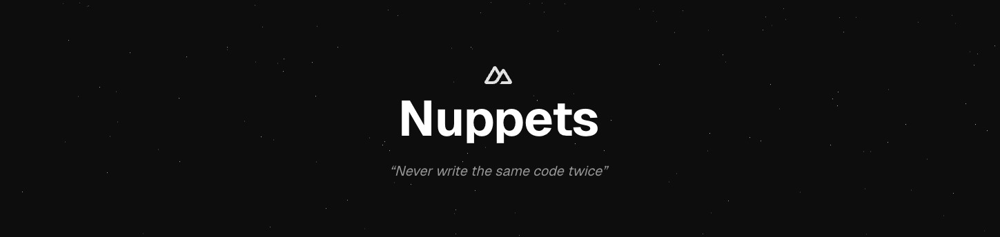

<div align="center">
  

### Your one-stop hub for Nuxt and Vue development resources

[Website](https://nuppets.dev)

  <div align="center">
    Made with 💚 for the Nuxt community
  </div>

  ---
</div>

## 🚀 About

Nuppets is a comprehensive hub designed to empower Nuxt and Vue developers. More than just a snippet collection, Nuppets brings together a curated set of development resources—including AI commands, practical code examples, and expert techniques—focusing on integrations with Raycast. While the platform is firmly centered around Raycast at the moment, support for additional providers (like VS Code) is on the roadmap, ensuring you always have the best tools to make your development more efficient.

## ✨ Features

-   📱 **Built around Raycast**: Developed with a focus on the Raycast ecosystem, with plans to support other providers in the future.
-   🎯 **Tailored for Nuxt and Vue**: Crafted specifically to address the needs and challenges of modern front-end development.
-   🔄 **Always Evolving**: Regular updates to keep pace with the ever-changing landscape of Nuxt and Vue.
-   🎨 **Easily Customizable**: Adaptable resources that integrate seamlessly into your workflow.
-   🤝 **Community-Powered**: Contributed by developers, for developers.

Actually, there is no support for VS Code yet. But it's on the roadmap!

<!-- automd:fetch url="gh:hugorcd/markdown/main/src/local_development_dev.md" -->

<details>
  <summary>Local development</summary>

- Clone this repository
- Install latest LTS version of [Node.js](https://nodejs.org/en/)
- Enable [Corepack](https://github.com/nodejs/corepack) using `corepack enable`
- Install dependencies using `bun install`
- Start development server using `bun dev`
- Open [http://localhost:3000](http://localhost:3000) in your browser

</details>

<!-- /automd -->

## 🤝 Contributing

Contributing to Nuppets is straightforward! We use Nuxt Content, making it easy to add new resources.
1.	Fork the repository
2.	Create a new `.yml` file in the `content/snippets` directory for example
3.	Follow the existing snippet format:
```yml
name: component
description: Create a new Vue component with script, template, and style
keyword: cc # The keyword used to trigger the snippet (don't specify prefix or suffix)
body: |
  <script setup lang="ts">
  
  </script>

  <template>
    <div>
      
    </div>
  </template>

  <style scoped>
  
  </style>
```
4.	Submit a PR and we'll review it as soon as possible!

That's it! No complex setup required. The project is designed to be as simple as possible to encourage contributions.

<!-- automd:contributors license=Apache author=HugoRCD github="hugorcd/nuppets" -->

Published under the [APACHE](https://github.com/hugorcd/nuppets/blob/main/LICENSE) license.
Made by [@HugoRCD](https://github.com/HugoRCD) and [community](https://github.com/hugorcd/nuppets/graphs/contributors) 💛
<br><br>
<a href="https://github.com/hugorcd/nuppets/graphs/contributors">

</a>

<!-- /automd -->

<!-- automd:with-automd lastUpdate -->

---

_🤖 auto updated with [automd](https://automd.unjs.io) (last updated: Sat Feb 08 2025)_

<!-- /automd -->
