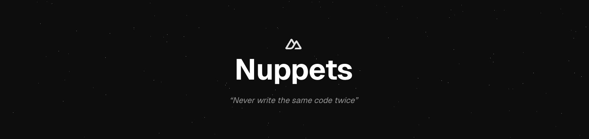

<div align="center">


# Nuppets

### Universal Nuxt snippets that work wherever you code

[Website](https://nuppets.dev)

</div>

## 🚀 About

Nuppets is more than just a snippet collection - it's a universal hub for Nuxt development resources. Starting with carefully crafted snippets available across multiple platforms (Raycast, VS Code, and more), Nuppets aims to become the go-to resource for everything that makes Nuxt development more efficient.

## ✨ Features

- 📱 **Cross-Platform**: Works with Raycast, VS Code, and more
- 🎯 **Purpose-Built**: Specifically designed for Nuxt development
- 🔄 **Always Updated**: Regular updates to match Nuxt's evolution
- 🎨 **Customizable**: Easy to adapt to your workflow
- 🤝 **Community-Driven**: Built by developers, for developers

<!-- automd:fetch url="gh:hugorcd/markdown/main/src/local_development_dev.md" -->

<details>
  <summary>Local development</summary>

- Clone this repository
- Install latest LTS version of [Node.js](https://nodejs.org/en/)
- Enable [Corepack](https://github.com/nodejs/corepack) using `corepack enable`
- Install dependencies using `bun install`
- Start development server using `bun dev`
- Open [http://localhost:3000](http://localhost:3000) in your browser

</details>

<!-- /automd -->

## 🤝 Contributing

Contributing to Nuppets is straightforward! We use Nuxt Content, making it easy to add new snippets.
1.	Fork the repository
2.	Create a new `.yml` file in the `content/snippets` directory
3.	Follow the existing snippet format:
```yml
name: component
description: Create a new Vue component with script, template, and style
keyword: cc # The keyword used to trigger the snippet (don't specify prefix or suffix)
body: |
  <script setup lang="ts">
  
  </script>

  <template>
    <div>
      
    </div>
  </template>

  <style scoped>
  
  </style>
```
4.	Submit a PR and we'll review it as soon as possible!

That's it! No complex setup required. The project is designed to be as simple as possible to encourage contributions.

<div align="center">
Made with 💚 for the Nuxt community
</div>

<!-- automd:contributors license=Apache author=HugoRCD github="hugorcd/nuppets" -->

Published under the [APACHE](https://github.com/hugorcd/nuppets/blob/main/LICENSE) license.
Made by [@HugoRCD](https://github.com/HugoRCD) and [community](https://github.com/hugorcd/nuppets/graphs/contributors) 💛
<br><br>
<a href="https://github.com/hugorcd/nuppets/graphs/contributors">

</a>

<!-- /automd -->

<!-- automd:with-automd lastUpdate -->

---

_🤖 auto updated with [automd](https://automd.unjs.io) (last updated: Sat Feb 08 2025)_

<!-- /automd -->
